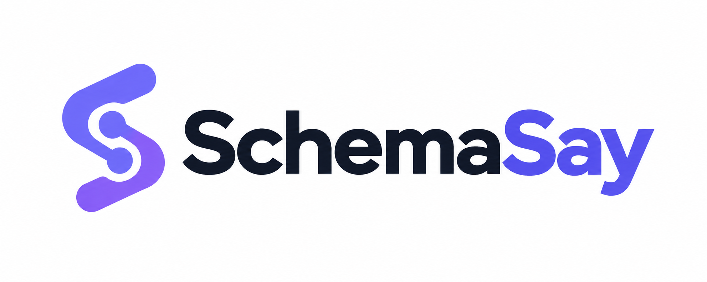
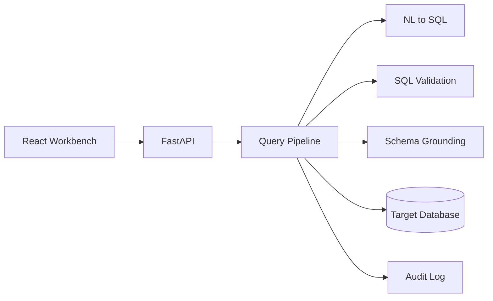

# SchemaSay

<p align="center">
  
</p>

<p align="center">
  <a href="https://github.com/krishankantjha/schemasay/actions/workflows/ci.yml"></a>
  <a href="LICENSE"></a>
  
  
  
</p>

> Ask questions in plain English and get answers from your database — with charts, explanations, and an audit trail.

SchemaSay is a full-stack analytics app. Connect a database, ask questions in natural language or run SQL by hand, and review results with trust signals and history.

**195 tests** · **7 product modules** · **FastAPI + React** · **Read-only SQL gate** · **Heuristic + optional LLM**

**Demo:** [TODO: Add live demo URL or screen recording link]

## Table of contents

- [Why I built this](#why-i-built-this)
- [Features](#features)
- [Screenshots](#screenshots)
- [Quick start](#quick-start)
- [Getting started](#getting-started)
- [Example walkthrough](#example-walkthrough)
- [How it works](#how-it-works)
- [Sample data for testing](#sample-data-for-testing)
- [Project structure](#project-structure)
- [Security](#security)
- [Testing](#testing)
- [Troubleshooting](#troubleshooting)
- [Known limitations](#known-limitations)
- [Roadmap](#roadmap)
- [License](#license)
- [Author](#author)

---

## Why I built this

Most NL→SQL tools stop at generating SQL. SchemaSay focuses on the full loop: schema-aware generation, read-only execution, governance rules, trust explanations, audit history, and user feedback — so analytics feels safe for people who do not write SQL every day.

---

## Features

- **Ask** — Natural-language questions turned into SQL, with results, charts, and a trust panel
- **SQL** — Manual SQL editor with formatting and execution
- **Schema** — Browse synced tables and columns for the active connection
- **Metrics** — Define reusable business metrics and preview them
- **Govern** — Set connection policies (blocked tables/columns, confidence rules)
- **Audit** — Query history, detail view, replay, and pipeline telemetry
- **Connections** — PostgreSQL, MySQL, SQL Server, SQLite, or CSV/Excel uploads; schema sync; business-language aliases
- **Auth** — Email/password login, token refresh, and optional Google sign-in
- **Feedback** — Rate whether an answer helped, with reason chips and optional SQL correction

Also included: saved queries and recent queries (browser storage), command palette, keyboard shortcuts, light/dark theme.

---

## Screenshots

> Add images to [`docs/screenshots/`](docs/screenshots/) and uncomment the lines below.

<!--  -->
<!-- *Natural-language query with results, chart, and trust panel.* -->

<!--  -->
<!-- *Connection setup with schema aliases.* -->

<!--  -->
<!-- *Audit detail with pipeline telemetry.* -->

[TODO: Add screenshots — save PNGs to `docs/screenshots/` and uncomment the lines above]

---

## Quick start

Minimal path to run locally (SQLite platform DB, no Docker):

```bash
git clone https://github.com/krishankantjha/schemasay.git
cd schemasay
cp .env.example .env
cp frontend/.env.example frontend/.env
```

Edit `.env`: set `DATABASE_URL=sqlite:///./backend/schemasay_local.db`, plus real `SECRET_KEY` and `ENCRYPTION_KEY` (see [Getting started](#getting-started)).

**Terminal 1 — backend:**

```bash
python -m venv .venv && .venv\Scripts\activate    # Windows
pip install -r backend/requirements.txt
alembic -c backend/alembic.ini upgrade head
$env:PYTHONPATH="backend"; uvicorn app.main:app --reload
```

**Terminal 2 — frontend:**

```bash
cd frontend && npm install && npm run dev
```

Open **http://localhost:5173** · API docs at **http://localhost:8000/docs**

---

## Getting started

### Prerequisites

- Python 3.10+
- Node.js 22+
- Optional: Docker (PostgreSQL platform DB)
- Optional: OpenAI or Gemini API key (without one, Ask uses the heuristic compiler)

### Configure environment

| Variable | Purpose |
|----------|---------|
| `DATABASE_URL` | Platform database (SQLite or PostgreSQL) |
| `SECRET_KEY` | JWT signing key (32+ characters) |
| `ENCRYPTION_KEY` | Fernet key for stored connection passwords |
| `OPENAI_API_KEY` / `GEMINI_API_KEY` | Optional LLM providers |
| `GOOGLE_CLIENT_ID` / `GOOGLE_CLIENT_SECRET` | Optional Google sign-in |

Generate a Fernet key:

```bash
python -c "from cryptography.fernet import Fernet; print(Fernet.generate_key().decode())"
```

**PostgreSQL (Docker):** `docker compose up -d` — use the `DATABASE_URL` from `.env.example`.

**SQLite (simplest):**

```env
DATABASE_URL=sqlite:///./backend/schemasay_local.db
```

On Windows, an absolute path also works: `sqlite:///C:/path/to/schemasay/backend/schemasay_local.db`

### Backend

```bash
pip install -r backend/requirements-dev.txt   # optional: tests and lint tools
alembic -c backend/alembic.ini upgrade head
```

```powershell
# Windows PowerShell
$env:PYTHONPATH="backend"
uvicorn app.main:app --reload
```

```bash
# macOS / Linux
PYTHONPATH=backend uvicorn app.main:app --reload
```

### Frontend

```bash
cd frontend
npm install
npm run dev
```

Vite proxies `/api` to port 8000 in development.

### First use

1. Create an account at http://localhost:5173 (or sign in with Google if configured).
2. Add a connection or upload a CSV/Excel file.
3. Sync schema.
4. Open **Ask** and run a question.

---

## Example walkthrough

**Question:** “How many orders were placed last month?”

| Step | What happens |
|------|----------------|
| 1 | Ask sends the question to `/api/v1/assistant/query` |
| 2 | Pipeline generates SQL (heuristic or LLM) |
| 3 | SQL is validated, grounded against schema, and checked against policies |
| 4 | Query runs on the target database (bounded row limit) |
| 5 | UI shows results table, chart, trust panel, and audit log entry |

Try **Audit** afterward to inspect the generated SQL and pipeline telemetry.

---

## How it works



- **NL→SQL:** Heuristic compiler works offline; LLM keys enable harder questions with heuristic fallback.
- **Pipeline:** Input → generation → schema grounding → policy checks → validation → execution → results, chart, trust explanation, audit log.

Interactive API docs (when the backend is running): http://localhost:8000/docs

---

## Sample data for testing

The eval harness uses a multi-table seed schema (`users`, `orders`, `products`, `order_items`, etc.). DDL is in `backend/tests/fixtures/eval_schema_metadata.py` (`EVAL_SEED_DDL`).

For manual E2E testing:

1. Create a SQLite file with those tables and sample rows, **or**
2. Upload a CSV with a single table for a quick smoke test.

Run the offline eval benchmark:

```bash
python backend/scripts/run_heuristic_eval.py
```

**Latest eval result (seed schema):** 20/20 cases passed (100% execution accuracy).

---

## Project structure

```text
schemasay/
├── backend/app/          # FastAPI app, pipeline, AI, security
├── backend/tests/        # 195 backend tests
├── frontend/src/         # React workbench
├── docs/screenshots/     # README images (optional)
├── .env.example
└── docker-compose.yml    # Optional PostgreSQL
```

---

## Security

SchemaSay is built for **approved database targets**, not open-ended connectivity.

- **SQL gate:** One read-only `SELECT` per request. Writes, stacked statements, `UNION`, and many dangerous patterns are blocked.
- **Connections:** Remote hosts need an explicit allowlist (`ALLOWED_DB_HOSTS`). SQLite paths are limited to approved directories.
- **Auth:** JWT access tokens; refresh tokens stored as SHA-256 hashes. Connection passwords encrypted with Fernet.
- **Limits:** Bounded upload size, query rows/columns, and rate limiting (Redis when `REDIS_URL` is set).

Target database accounts should still be **read-only** — app validation is defense in depth, not a substitute for DB permissions.

---

## Testing

**Backend (195 tests):**

```powershell
$env:DATABASE_URL="sqlite:///:memory:"
$env:SECRET_KEY="test-secret-key-0123456789-0123456789"
$env:ENCRYPTION_KEY="7c2w6QFqE7d3hK2x5uXvGmYwQ8rTnZpL0sA1bC2dE3f="
$env:PYTHONPATH="backend"
python -m pytest -q backend/tests
```

**Frontend:**

```bash
cd frontend && npm run build
```

**CI (GitHub Actions):** pytest, ruff, bandit, pip-audit, Alembic migration check, and `npm run build` on every push and pull request.

---

## Troubleshooting

| Problem | Fix |
|---------|-----|
| Startup rejects `.env` values | Replace placeholder `SECRET_KEY` and `ENCRYPTION_KEY` with generated values (32+ chars) |
| `ModuleNotFoundError: app` | Set `PYTHONPATH=backend` before running uvicorn |
| Frontend cannot reach API | Ensure backend is on port 8000; Vite proxy handles `/api` in dev |
| SQLite path errors on Windows | Use forward slashes: `sqlite:///C:/path/to/file.db` |
| Google sign-in fails | Set `GOOGLE_CLIENT_ID`, `GOOGLE_CLIENT_SECRET`, and matching redirect URIs |
| No LLM responses | Expected without API keys — heuristic compiler still works for many questions |

---

## Known limitations

- Complex multi-table questions may need manual SQL or schema aliases.
- Insights work best with an LLM key; some cases use rule-based summaries.
- Saved queries and recent queries are stored in the browser only.
- Public deployment not set up yet.

---

## Roadmap

| Status | Item |
|--------|------|
| Done | Core product loop (Ask, SQL, Schema, Metrics, Govern, Audit, Connections) |
| Done | Heuristic compiler, eval harness, audit telemetry, answer-focused feedback |
| TODO | Live demo deployment |
| TODO | README screenshots and demo video |

---

## License

MIT License — see [LICENSE](LICENSE).

---

## Author

**Krishan Kant Jha**

- GitHub: [krishankantjha](https://github.com/krishankantjha)
- LinkedIn: [TODO: Add your LinkedIn URL]

Contributions welcome — open an issue or pull request.
